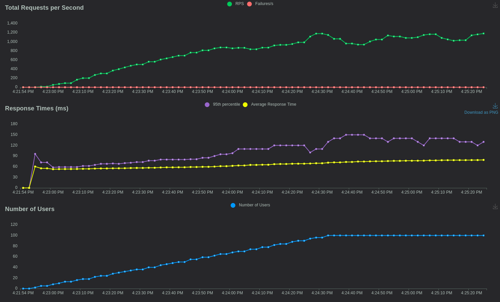

## Locust is used to perform load tests on APIs and Web Apps

As we can see on the charts, the tests seem to have run smoothly, with no errors or failures. The number of users and requests per second are stable, and the response time is consistent.